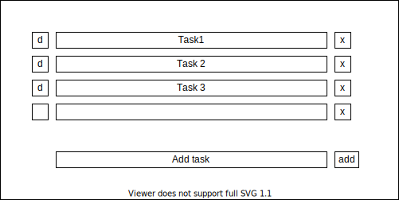

# TODO App

## Goal

* Show a list of todo items
    * each item should have a checkbox to indicate if it is done
    * each item should have a button to delete it

* Show a text box and a "new" button to create new todo items

## Mockup

